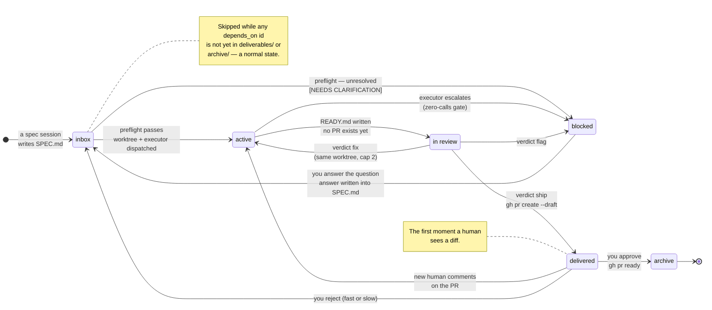

# Architecture

How drydock is put together, and why each piece is shaped the way it is. The
[README](../README.md) is the tour; this is the part you read before changing
something.

## The one-sentence version

A git repository is the state machine, Markdown files are the rules, and every
moving part is a separate Claude Code process that reads those rules fresh and
communicates only through files on disk.

## The actors

Five roles. None of them is a service, and none of them holds state in memory
that matters — every one can be killed and restarted, and the queue on disk
tells the next one everything it needs.

| Actor | Lives in | Reads | Writes | Lifetime |
|---|---|---|---|---|
| **Spec session** | Your normal work session | The conversation you were already having | `specs/inbox/<id>/SPEC.md` | The length of the discussion |
| **Orchestrator** | A pinned pane, longest-running model | [`ORCHESTRATOR.md`](../contracts/ORCHESTRATOR.md) + [`DISPATCH.md`](../contracts/DISPATCH.md), every tick | Queue moves, commits, notifications | Hours to days |
| **Executor** | A background session in a git worktree | `SPEC.md`, [`PRIORS.md`](../contracts/PRIORS.md), DISPATCH steps 9–11 | Code on a branch, `RUN.md`, then `READY.md` **or** `QUESTION.md` | One spec, one attempt |
| **Reviewer** | A background session on the worktree | [`REVIEWER.md`](../contracts/REVIEWER.md), the diff, the target repo's conventions | `REVIEW.md` — nothing else, ever | One review round |
| **Review pass** | You, once a day | `deliverables/`, `specs/blocked/` | Verdicts: approve, reject fast, reject slow | Minutes |

The orchestrator is deliberately the thinnest of these. It never writes code
and never judges a deliverable — it moves state, dispatches, and verifies. Both
of the jobs it refuses are jobs where being wrong is expensive, and both are
handled by an actor with a contract of its own.

## Lifecycle

The three edges you drive yourself are `/drydock:spec` into the inbox,
`/drydock:spec unblock <id>` out of `blocked`, and `/drydock:review` out of
`deliverables`. Every other transition is the orchestrator's.

The cycle worth internalising is `active → in review → active`: a loop that
runs entirely inside one worktree, with no pull request, no inbox round-trip,
and no human. It is where most of drydock's value is produced.

## The zero-calls gate

The rule is in [`DISPATCH.md`](../contracts/DISPATCH.md) step 10: **delivering
with caveats is forbidden.** An executor may finish, or it may escalate. There
is no third option where it ships something with a note attached.

Any of these sends the item to `specs/blocked/` with a `QUESTION.md`:

- an escalation condition fired, or any acceptance criterion is not passing;
- any step outside the declared blast radius was taken or appears necessary —
  and a breach *already committed* is still an escalation, not a footnote;
- anything at all would "need the human's call".

The name is the point: by the time you see a pull request, the number of
decisions it still needs from you is zero.

**Why this rather than a rich PR description.** The failure mode of every
autonomous pipeline is a deliverable that is 90% right with the remaining 10%
buried in prose. That prose gets skimmed, because a PR is a review artifact and
reviewers read diffs, not preambles. Forcing the escalation to happen *before*
the PR exists changes the channel: a `blocked` item is a question you answer in
a conversation with full context, not a caveat you scroll past. And it changes
the economics — answering a question costs one exchange; discovering the same
problem in review costs a round trip through the whole pipeline.

The corollary is that **"the work is complete and the failure isn't mine" is
not an exemption.** An executor that finishes its own task and then finds the
repo's test suite broken by someone else has still hit a decision it cannot
make. That is the escalation.

## Stateless handoff

Executors are stateless by design. After an unblock, a **fresh** executor picks
the item up — never the escalating session resurrected.

This is a deliberate trade. Resuming the original session would preserve its
context, but it would also preserve everything that led it astray: the wrong
assumption it made three hours ago, the half-explored dead end, the tool output
it misread. A fresh executor starts from artifacts that were written to be read
cold.

It only works if the handoff is complete, so `DISPATCH.md` requires an
escalating executor to, before writing `QUESTION.md`:

1. **commit all work in progress to the branch and push it** — an unpushed
   worktree gets pruned, and pruned work is lost work;
2. **leave `RUN.md` as a handoff a stranger could resume from** — where the
   work stands, what remains, what was ruled out and why;
3. **make `QUESTION.md` self-contained** — the concrete decision, the options,
   what was already eliminated. Never a bare "it failed".

The same discipline is what makes the queue restartable. Kill the orchestrator
mid-tick and nothing is lost: the next tick re-derives every item's state from
directory locations, `RUN.md` mtimes, and live session liveness. **Disk is
truth**, and the contract says so explicitly — an orchestrator may never narrate
a status it did not verify.

`QUESTION.md` also outlives the unblock. The resolution is appended to it —
decision, rationale, options rejected and why — and the file stays in the item
directory as history. That record is what `/drydock:retro` mines later; a
resolution that lives only in the spec's diff has lost its reasoning.

## Why review happens in the worktree

The reviewer runs on the branch, against `git diff <base>...HEAD`, before any
pull request exists. Three consequences follow, and they are the reason for the
whole arrangement:

- **`fix` is cheap.** A fix executor runs in the same worktree against the
  reviewer's findings, and re-review is round `N+1`. No PR churn, no force-push
  history, no notification to your team, no inbox round-trip.
- **`flag` reaches you before anyone else sees anything.** A design
  disagreement the reviewer cannot reduce to an executable check becomes a
  blocked item, not a PR comment thread.
- **`ship` means the PR opens already-fixed.** Title and body ship verbatim
  from `READY.md`, written to the *target* repo's conventions — discovered from
  its PR template, its contributing docs, and recently merged human PRs.

The reviewer is adversarial on purpose. Its instruction is to try to reject the
work, and a `ship` verdict has to say what it tried and failed to break. It
also carries a **round cap of 2**: work that survives two fix rounds without
shipping becomes a `flag` regardless, because a third mechanical round is
usually a sign the spec was wrong, not the code.

Its powers are narrow by construction — it writes `REVIEW.md` and nothing else.
It never edits the worktree, the spec, or `READY.md`, and it never opens a pull
request. Separating the judgment from the ability to act on it is what keeps a
`fix` verdict honest.

## Git as the state machine

There is no database, no scheduler, and no daemon. A spec's directory location
*is* its state, every transition is a commit, and the commit log is the audit
trail: who moved what, when, and (from the message) why.

What this buys:

- **Restartability.** Any actor can die at any point. State is on disk.
- **Inspectability.** `git log` answers "what happened to this item" without a
  query language, and `git diff` answers "what changed in the rules".
- **Editability mid-flight.** Contracts are re-read on every invocation, so
  amending `REVIEWER.md` changes the next review — including for a loop that
  is already running. The contracts say this explicitly: the latest version
  always wins, and no actor may work from a remembered copy.
- **Backup that already exists.** Push the drydock repo and your queue's full
  history is backed up by the same mechanism as your code.

What it costs: transitions are not atomic in the database sense, ordering must
be derived deterministically rather than assumed (hence lexicographic-by-id
FIFO — mtime is reset by the very moves the queue makes), and concurrency is
bounded by convention (two executions, one orchestrator via a heartbeat file)
rather than by locks. For a queue whose items take tens of minutes and whose
operator is one person, these are the right trades.

## The target repo stays clean

A repository drydock works on carries **zero drydock metadata**. No spec files
committed there, no labels, no tags, no branch-name registry. The branch and
the pull request are the entire footprint.

This is what lets drydock run against a repository owned by a team that has not
adopted it — and has never heard of it. Your colleagues see a branch and a
well-formed PR in the house style. Nothing in the diff, the description, or the
commits mentions a spec id or a drydock path; `DISPATCH.md` step 11 makes that
an explicit executor obligation, and the reviewer checks for leaked
terminology as part of every hunt.

The bookkeeping cost lands on drydock instead: the drydock repo is the sole
registry of which PRs are ours, and PR state is read back per **recorded URL**
(`gh pr view <url>`), never by scanning the target repo's PR list. Scanning
would pick up your teammates' work.

## Processes, not subagents

Executors and reviewers are dispatched as independent background CLI sessions
(`claude --bg`), never as in-process subagents. The contracts state this as a
hard rule, for three reasons: in-process subagents bloat the orchestrator's
context, they die when the orchestrator's session ends, and they are invisible
to the session list — which is one of the three sources the orchestrator uses
to verify that a run is actually alive.

Being separate OS processes is also what makes the permission story work. Each
executor loads *your* configuration independently — `settings.json`, `PreToolUse`
hooks, deny rules — so the policy you enforce interactively is enforced inside
every executor, per process. `--permission-mode bypassPermissions` exists only
because a background session has nobody to answer a prompt; it suppresses the
interactive prompt, not your deny layer. See [SECURITY.md](../SECURITY.md).

## How the system changes itself

`/drydock:retro` runs automatically after every ship, over that item's history
alone, and sorts what it finds into exactly one of three tiers:

| Tier | Lands in | Applied by |
|---|---|---|
| **Prior** — an advisory fact about a repo, build system or reviewer | [`PRIORS.md`](../contracts/PRIORS.md) | The retro, directly. Priors are knowledge, not policy |
| **Rule** — a process failure no prior can fix | [`PROPOSALS.md`](../contracts/PROPOSALS.md), with evidence, cost, risk and a suggested diff | **A human only**, in the review pass or a full sweep |
| **Skill defect** — a plugin skill produced the failure | The skill itself | Whatever skill-improvement pass you use |

The separation is the safeguard. An autonomous pass may append knowledge, but a
system that rewrites its own governing rules without a human in the loop is one
bad inference away from drifting somewhere nobody chose. A proposal without a
stated cost is recorded as a preference, not a proposal.

`PRIORS.md` ships empty, and should stay empty until your own runs fill it. A
prior inherited from someone else's codebase is misinformation to your
executors — it will be cited confidently and be wrong. See
[`examples/example-priors.md`](../examples/example-priors.md) for the shape of
one worth keeping: a named mechanism, the command that proves or disproves it
today, and the item that taught it.
