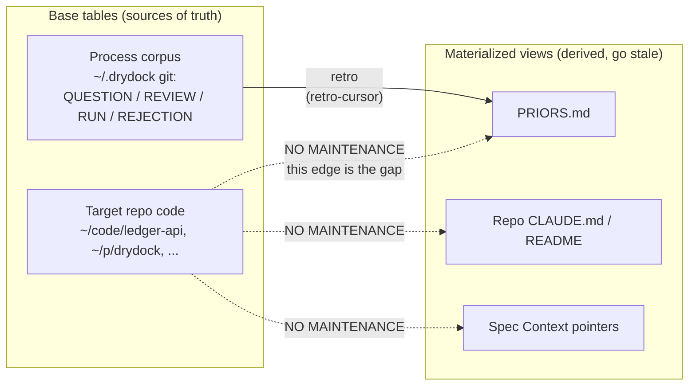

# drydock as an incremental materialized view

## Context

drydock's retro loop is currently described — including by me, earlier in this
session — as "already incremental view maintenance over the process." Reading
the 0.3.0 contracts and the live `~/.drydock` state, that claim is about half
true, and the untrue half is the part that matters. drydock has the *cursor*
idiom in two places already, but it has no dependency tracking, no invalidation
keyed to the base data, and no propagation step at all. What it has is an
append-mostly log with a watermark.

Separately, `PRIORS.md` is 322 lines / 21KB after roughly four shipped specs,
and `contracts/DISPATCH.md:108` hands **the whole file** to every executor
(*"First read `<STATE_HOME>/PRIORS.md`"*). The file already self-partitions by
repo — `## Target repo: ~/code/ledger-api` at line 11,
`## Target repo: ~/p/drydock` at 119 — so a drydock-targeted spec currently
reads ~108 lines of ledger-api-specific git-fetch lore before it starts. The
partition exists in the prose and not in the loader.

Both problems have the same root: drydock treats accumulated knowledge as a
single undifferentiated blob that only grows. This doc proposes making the
materialized-view framing literal rather than metaphorical, and splitting the
blob along hot/cold and phase lines.

`PRIORS.md` is global by construction rather than by choice. PR #3 (merged
2026-09-12, `0ccc22e`) split `PLUGIN_HOME` from `STATE_HOME` to close a
leak vector — before it, the install clone was simultaneously the plugin and the
queue, with a real `origin`. That refactor deliberately consolidated all state
into one `~/.drydock` with **no remote, ever**, and made a remote appearing there
a hard stop. The `## Target repo:` headings inside `PRIORS.md` are a convention
that grew *inside* that deliberately-single file. Everything proposed below
partitions within `STATE_HOME` and preserves that property.

## Goals

- Make priors **invalidatable** — a prior about a repo's layout should not
  survive that layout changing.
- Make prior loading **scoped** — an executor reads what its repo and its phase
  need, not the union of everything ever learned.
- Keep the change **mechanical where possible**: reuse drydock's existing cursor
  idiom rather than introducing new machinery.
- Preserve the repo-agnostic footprint rule.

## Non-goals

- Building a code index, embedding store, or semantic search over target repos.
  The Merkle-diff index work belongs to tooling, not to drydock.
- Auto-editing target repos' own `CLAUDE.md` / `README.md` in v1 (see
  Trade-offs — this is the interesting boundary, and it is deliberately
  deferred).
- Touching `PROPOSALS.md`, which is a queue rather than a view.

## Proposal

### The model, stated properly



Real IVM needs four things. drydock has one and a half:

| Requirement | Status in 0.3.0 |
|---|---|
| A watermark per view | **Has it.** `retro-cursor` in PRIORS.md; `comments_seen:` in DELIVERABLE.md. Established idiom. |
| Delta capture on the base table | **Partial.** Only over `~/.drydock`'s own git. Nothing observes the target repos. |
| Propagation on write | **Missing.** Shipping and landing a PR updates no view. |
| Retraction / invalidation | **Instructed, not mechanised.** Retro says *"prune any prior the corpus shows to be wrong or obsolete"* — but the trigger is the process corpus, never the code. |

Changes 1–3 below close rows 2–4 in that order of cost. Change 0 comes first
because Change 4's phase-scoped loading assumes it exists.

### Change 0 — a `PLAN.md` phase with a hard context reset

Today DISPATCH step 8 goes `SPEC.md` → executor, and the executor plans
privately in its own context. Nothing reviewable exists between "what to build"
and "a PR appeared", and the research transcript — every file the executor
opened while figuring out the approach — rides along into implementation.

Split the executor in two, with the artifact as the only handoff:

| Phase | Reads | Writes | Then |
|---|---|---|---|
| **Plan** | `SPEC.md`, priors (hot + repo), the repo | `PLAN.md` | agent exits |
| **Gate** | `PLAN.md` | approve / flag | reviewer agent, or the human |
| **Implement** | `SPEC.md`, `PLAN.md`, priors — **nothing else** | the diff, `RUN.md`, `READY.md` | as today from step 9 |

The implement executor never sees the plan-phase session. That is the point:
the research is the noise, the plan is the signal, and carrying the former into
implementation is what degrades long runs. The gate is where the human's
leverage is highest — reviewing a plan costs minutes, reviewing a wrong diff
costs an hour.

`PLAN.md` has one mandatory section. Tasks are *structure inside the plan*,
not a third artifact — a separate `TASKS.md` would duplicate what `RUN.md`
(resumption) and the acceptance criteria (verification) already do, and add one
more document to drift:

```markdown
## Tasks
| # | Task | Files | Verify | After |
|---|------|-------|--------|-------|
| T1 | Add watermark field to priors format | priors/*.md | grep passes | — |
| T2 | Preflight step 5 reads the watermark | contracts/DISPATCH.md | board test | T1 |
| T3 | Stale-flag rendering on the board | board/ | unittest | T2 |
```

The executor works the rows in order and ticks each in `RUN.md` with its verify
output. A fresh executor after an unblock resumes from the first unticked row
rather than re-deriving where things stood. Two signals would justify promoting
tasks to first-class later, both measurable in retro: `RUN.md` handoffs keep
losing "where was I", or you want tasks fanned out across `max_agents` — the
latter also requires solving parallel writers in one worktree first.

### Change 1 — give every prior a dependency set

Today a prior is a bullet plus a citing item id. That is enough to attribute it
and not enough to invalidate it. Make it a record:

```markdown
- **[ledger-api/git-fetch]** `git fetch origin main:main` is refused while
  `~/code/ledger-api` has main checked out in the primary worktree.
  - scope: `~/code/ledger-api`
  - derived_from: `2026-08-31-preflight-repair`
  - depends_on: primary worktree keeps main checked out; `.git/HEAD`, `.git/worktrees/**`
  - asserted: 2026-08-31
```

`depends_on` is the load-bearing field. It is the row's dependency set, and
without it the only available refresh strategy is *full* refresh — re-deriving
every prior from scratch. That is what "regenerate the docs periodically" means
in practice, it is expensive, and it is why nobody ever does it.

**Format (decided 2026-09-18): free text, which may embed path globs in
backticks.** Most real priors in today's file are facts about environment state
("main is checked out in the primary worktree"), not paths, so free text is the
primary representation. Globs, when present, give Change 3 a mechanical
pre-filter; the text is what an agent judges. A prior with text and no globs is
legal and simply always reaches the judgment stage.

`depends_on: unknown` must stay legal. It means "never auto-invalidated", which
is exactly today's behaviour, so the format degrades gracefully and no backfill
is required to ship.

### Change 2 — a third cursor, per target repo

Add a per-repo watermark to the priors for that repo: the last commit SHA of
`~/code/ledger-api` those priors were validated against.

Dispatch preflight step 5 **already** runs `git -C <target_repo> fetch origin`
and already does `rev-list --count` freshness comparisons for the chain-branch
rule. This reuses both. If the repo has moved since the watermark, the priors
scoped to it are marked **stale, not wrong**, and the watermark advances when a
retro re-validates them.

Marking rather than deleting is the deliberate choice: a stale prior still loads
and still helps, it just carries a flag the executor can weigh. Auto-deleting on
repo movement would discard knowledge on every unrelated commit.

### Change 3 — propagate at archive, not at ship

The commit point for view maintenance is **DISPATCH step 14** — the human
approves and the item moves to `archive/`. That is the moment the change is both
landed *and* accepted. Ship (step 12) is too early; a draft PR can still be
rejected.

At archive, walk the landed diff and, for every prior whose `depends_on` the
diff plausibly touches, re-validate or retract it. This is the missing
propagation edge in the diagram. It runs in two stages, following the
`depends_on` format decided in Change 1:

1. **Mechanical pre-filter.** Any glob embedded in a prior's `depends_on` is
   matched against the diff's file list (`git diff --name-only <base>..<landed>`).
   A hit makes the prior a candidate. Priors with no globs are always
   candidates — the pre-filter can only narrow, never exclude.
2. **Agent judgment.** For each candidate, an agent reads the free-text
   dependency and the relevant hunks and returns one of `holds` / `stale` /
   `retract`, with the hunk that decided it. `holds` advances nothing;
   `stale` flags the prior in place; `retract` removes it and records why in
   the `<STATE_HOME>` commit, exactly as retro's pruning rule already does.

The pre-filter is what keeps stage 2 cheap on a large diff; the judgment stage
is what keeps a text-only prior from being silently exempt.

**Scope it to `<STATE_HOME>` views — not as a cautious v1 choice, but as the
one consistent with PR #3.** Two landed rules point the same way. DISPATCH's
repo-agnostic rule: *"the target repo carries zero drydock metadata — no labels,
tags, or spec files committed there. Branch + PR are the only footprint."* And
PR #3's thesis: drydock-derived state must never live in a tree that is
pushable. Writing priors into a target repo's `CLAUDE.md` is arguably code
content rather than metadata, so it does not violate the letter of either — but
it is the same *shape* as the leak PR #3 closed (drydock knowledge landing in a
repo with a real origin), and it would make target repos a write surface outside
any spec's declared blast radius. The burden of proof sits on doing it, not on
abstaining.

Where repo docs genuinely need refreshing, that refresh becomes **its own
spec** — with a blast radius, acceptance criteria and adversarial review like
any other change. drydock specs its own documentation maintenance, and the
footprint rule stays intact.

### Change 4 — hot / cold, sliced by phase as well as repo

The layout:

```text
~/.drydock/
  PRIORS.md                 # HOT — global, always loaded. Hard cap ~50 lines.
  priors/
    ledger-api.md           # COLD — loaded iff target_repo matches
    drydock.md
    _spec-writing.md        # COLD — loaded by /drydock:spec, never by executors
    _pr-prose.md            # COLD — loaded at READY (step 11) only
    _review.md              # COLD — loaded by the reviewer
```

The routing rule is one line in DISPATCH step 8: the executor reads `PRIORS.md`
plus `priors/<slug(target_repo)>.md`. Today's file already carries the section
headings that become those filenames, so step one is a `csplit`, not a rewrite.

The sharper half is **phase** scoping, not repo scoping. The current "global"
sections are not all hot: `## PR prose is where the defects are` (line 152) is
needed only at step 11, and `## Spec-writing` (line 145) is needed only by
`/drydock:spec` and never by an executor at all. So the genuinely hot set is
*smaller* than today's global set:

| Consumer | Hot | Cold, conditional |
|---|---|---|
| `/drydock:spec` | `PRIORS.md` | `_spec-writing.md` |
| Executor — implement | `PRIORS.md` | `<repo>.md` |
| Executor — READY (step 11) | — | `_pr-prose.md` |
| Reviewer | `PRIORS.md` | `<repo>.md`, `_review.md` |
| Retro | everything | — (it is the writer) |

This is Anthropic's just-in-time retrieval principle applied at drydock scale,
and it depends on Change 0 — the phase rows in this table only exist once the
executor is split. Each phase declares what it loads.

### The scaling problem underneath

Partitioning is mechanical. **Promotion is not**, and it is the part that
actually breaks at N repos: nothing detects when a `~/code/ledger-api` prior
turns out to be universal. The only cheap signal available is repetition — if
the same lesson is asserted independently under two different repo files, retro
promotes it to hot and deletes both copies. That becomes an explicit rule in
retro's Distill step.

Known future cut, not solved here: per-repo files will eventually need their own
hot/cold split. `ledger-api.md` is 108 lines after four specs.

## Trade-offs

- **Retro's write path gets harder.** Every new prior needs a `depends_on` the
  retro agent must reason about, and some will be wrong. Mitigated by
  `depends_on: unknown` being legal, but the quality ceiling of this whole
  design is the quality of that field.
- **Staleness marking is not correctness.** A stale prior still loads. The
  system gets *honest*, not *right*.
- **Splitting PRIORS costs grep-ability.** One file is easy to read end to end;
  six are not. `/drydock:board` printing the index mitigates this partially.
- **v1 does not touch repo docs**, so the `CLAUDE.md` drift you actually have
  keeps drifting. That is the price of keeping the zero-footprint rule intact,
  and it is the right price for one release.
- **More moving parts in a loop whose main virtue is that it is thin.** Three of
  the four changes add contract surface to DISPATCH, which is already the
  longest contract.

## Open questions

1. **Largely settled, confirm the reading.** Is a target repo's own `CLAUDE.md`
   ever in scope for drydock to write? PR #3's precedent says no — drydock
   state stays out of anything pushable. The remaining question is only
   whether repo-doc content counts as "drydock state" for that rule. If yes,
   Change 3 is `<STATE_HOME>`-only permanently and repo-doc refresh is always
   its own spec. If no, the door is open, but nothing in this doc needs it.
2. ~~`depends_on` granularity~~ — **decided 2026-09-18**: free text that may
   embed path globs. See Change 1 for the format and Change 3 for how each half
   is consumed.
3. Promotion threshold: two independent assertions, or three?
4. Does `PROPOSALS.md` (33KB) need any of this, or just pruning? It reads as a
   queue, not a view.
5. Who runs the Change 0 gate by default — the reviewer agent, with the human
   only on `flag`, or the human always? The former keeps the loop autonomous;
   the latter is where the leverage argument says the human's minutes are best
   spent.

## Rollout

Each step is independently shippable as a drydock spec — and drydock building
drydock has precedent in `2026-09-12-drydock-chain-branch-pr`.

| # | Change | Risk | Notes |
|---|---|---|---|
| 0 | `PLAN.md` phase: split DISPATCH step 8 into plan / gate / implement; `PLAN.md` template with mandatory `## Tasks` | Medium | Contract change to DISPATCH plus a new template. Ships before or alongside step 1 — Change 4's phase loading needs it. |
| 1 | Split `PRIORS.md` into hot + `priors/*.md`; routing rule in DISPATCH step 8 | Very low | Pure mechanical `csplit` on existing headings; no semantics change. Dispatchable today (2026-09-18). |
| 2 | Provenance fields in the prior format; amend retro's Distill step | Low | New priors only; backfill opportunistically. |
| 3 | Per-repo `code-cursor` + staleness marking at preflight step 5 | Medium | Reuses the existing `fetch` and `rev-list` machinery. |
| 4 | Propagation at archive (step 14), `<STATE_HOME>` views only | Medium | Consistent with PR #3; anything wider needs the reading in open question 1 confirmed first. |

Ordering is the commitment; step 1 is worth doing regardless of whether the rest
of this design survives review, because it is strictly less context per executor
for zero behavioural change.
